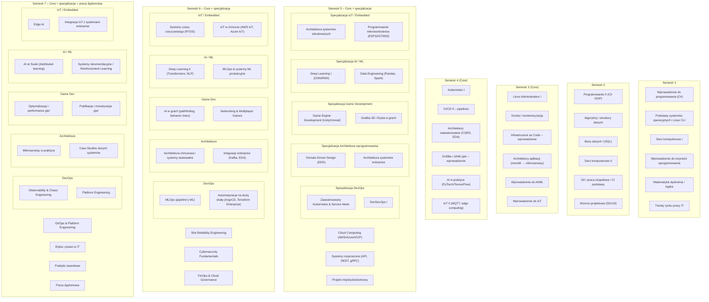

# Program Studiów — Diagram Mermaid

Poniżej znajduje się pełny diagram programu studiów wraz z zależnościami między przedmiotami, zapisany w formacie **Mermaid**.

```mermaid
flowchart TB

%% =======================
%% Semestr 1
%% =======================
subgraph S1["Semestr 1"]
  P1["Wprowadzenie do programowania (C#)"]
  OS1["Podstawy systemów operacyjnych i Linux CLI"]
  NET1["Sieci komputerowe I"]
  SE1["Wprowadzenie do inżynierii oprogramowania"]
  MATHDIS["Matematyka dyskretna / logika"]
  TRENDS["Trendy rynku pracy IT"]
end

%% =======================
%% Semestr 2
%% =======================
subgraph S2["Semestr 2"]
  P2["Programowanie II (C# OOP)"]
  ALGDS["Algorytmy i struktury danych"]
  DB1["Bazy danych I (SQL)"]
  NET2["Sieci komputerowe II"]
  GITCI["Git i praca zespołowa / CI podstawy"]
  DESIGN1["Wzorce projektowe (SOLID)"]
end

%% =======================
%% Semestr 3
%% =======================
subgraph S3["Semestr 3 (Core)"]
  LNX1["Linux Administration I"]
  DOCKER["Docker i konteneryzacja"]
  IAC1["Infrastructure as Code – wprowadzenie"]
  ARCH1["Architektury aplikacji (monolit → mikroserwisy)"]
  AI_INTRO["Wprowadzenie do AI/ML"]
  IOT_INTRO["Wprowadzenie do IoT"]
end

%% =======================
%% Semestr 4
%% =======================
subgraph S4["Semestr 4 (Core)"]
  K8S1["Kubernetes I"]
  CICD2["CI/CD II – pipelines"]
  ARCH_ADV["Architektury zaawansowane (CQRS, EDA)"]
  GAME_INTRO["Grafika i silniki gier – wprowadzenie"]
  AI_PRACT["AI w praktyce (PyTorch/TensorFlow)"]
  IOT2["IoT II (MQTT, edge computing)"]
end

%% =======================
%% Semestr 5
%% =======================
subgraph S5["Semestr 5 – Core + specjalizacje"]
  CORE_CLOUD["Cloud Computing (AWS/Azure/GCP)"]
  CORE_DISTSYS["Systemy rozproszone (API, REST, gRPC)"]
  CORE_PROJ["Projekt międzydziedzinowy"]

  subgraph DEVOPS5["Specjalizacja DevOps"]
    DEVOPS_K8S_ADV["Zaawansowany Kubernetes & Service Mesh"]
    DEVOPS_SEC1["DevSecOps I"]
  end

  subgraph ARCH5["Specjalizacja Architektura oprogramowania"]
    ARCH_DDD["Domain-Driven Design (DDD)"]
    ARCH_ENT["Architektura systemów enterprise"]
  end

  subgraph GAME5["Specjalizacja Game Development"]
    GAME_ENGINE["Game Engine Development (Unity/Unreal)"]
    GAME_3D["Grafika 3D i fizyka w grach"]
  end

  subgraph AI5["Specjalizacja AI / ML"]
    AI_DL1["Deep Learning I (CNN/RNN)"]
    AI_DATAENG["Data Engineering (Pandas, Spark)"]
  end

  subgraph IOT5["Specjalizacja IoT / Embedded"]
    IOT_ARCH["Architektura systemów wbudowanych"]
    IOT_MCU["Programowanie mikrokontrolerów (ESP32/STM32)"]
  end
end

%% =======================
%% Semestr 6
%% =======================
subgraph S6["Semestr 6 – Core + specjalizacje"]
  CORE_SRE["Site Reliability Engineering"]
  CORE_SEC["Cybersecurity Fundamentals"]
  CORE_FINOPS["FinOps & Cloud Governance"]

  subgraph DEVOPS6["DevOps"]
    DEVOPS_MLOPS["MLOps (pipeline’y ML)"]
    DEVOPS_AUTO["Automatyzacja na dużą skalę (ArgoCD, Terraform Enterprise)"]
  end

  subgraph ARCH6["Architektura"]
    ARCH_CLOUD["Architektura chmurowa i systemy skalowalne"]
    ARCH_INT["Integracje enterprise (Kafka, EDA)"]
  end

  subgraph GAME6["Game Dev"]
    GAME_AI["AI w grach (pathfinding, behavior trees)"]
    GAME_NET["Networking & Multiplayer Games"]
  end

  subgraph AI6["AI / ML"]
    AI_DL2["Deep Learning II (Transformers, NLP)"]
    AI_MLOPS["MLOps & systemy ML produkcyjne"]
  end

  subgraph IOT6["IoT / Embedded"]
    IOT_RTOS["Systemy czasu rzeczywistego (RTOS)"]
    IOT_CLOUD["IoT w chmurze (AWS IoT, Azure IoT)"]
  end
end

%% =======================
%% Semestr 7
%% =======================
subgraph S7["Semestr 7 – Core + specjalizacje + praca dyplomowa"]
  CORE_GITOPS["GitOps & Platform Engineering"]
  CORE_ETHICS["Etyka i prawo w IT"]
  CORE_PRACTICE["Praktyki zawodowe"]
  CORE_DIPLOMA["Praca dyplomowa"]

  subgraph DEVOPS7["DevOps"]
    DEVOPS_OBS["Observability & Chaos Engineering"]
    DEVOPS_PLAT["Platform Engineering"]
  end

  subgraph ARCH7["Architektura"]
    ARCH_MICRO["Mikroserwisy w praktyce"]
    ARCH_CASE["Case Studies dużych systemów"]
  end

  subgraph GAME7["Game Dev"]
    GAME_OPT["Optymalizacja i performance gier"]
    GAME_PUB["Publikacja i monetyzacja gier"]
  end

  subgraph AI7["AI / ML"]
    AI_SCALE["AI at Scale (distributed learning)"]
    AI_REC["Systemy rekomendacyjne / Reinforcement Learning"]
  end

  subgraph IOT7["IoT / Embedded"]
    IOT_EDGEAI["Edge AI"]
    IOT_INT["Integracja IoT z systemami enterprise"]
  end
end
```
